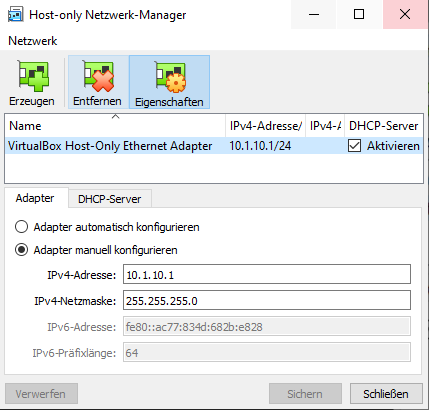
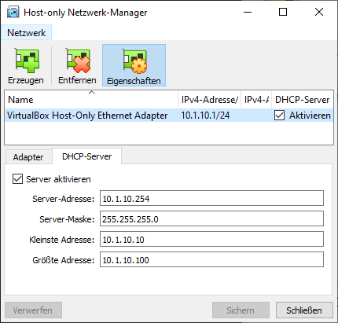
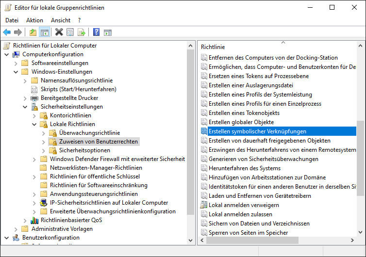

# Development Vagrant

# Vorbereitung
## 1. VirtualBox
VirtualBox + VirtualBox Extension herunterladen und installieren: https://www.virtualbox.org/wiki/Downloads

Neues Host Only Netzwerk erstellen:




## 2. Vagrant
Vagrant herunterladen und installieren: https://www.vagrantup.com/


## 3. Vagrant Plugins
In der Konsole, z.B. PowerShell, die benötigten Vagrant Plugins installieren:
```powershell
PS C:\> vagrant plugin install vagrant-hostmanager
PS C:\> vagrant plugin install vagrant-vbguest
PS C:\> vagrant plugin install vagrant-winnfsd
```


## 4. Traffic in der Firewall erlauben
Damit die Box auch erreichbar ist, sollte jeglicher TCP/UDP Traffic zugelassen werden.
Hier 10.1.10.1 - 10.1.10.100 für TCP/UDP freugeben


## 5. Gruppenrichtlinien anpassen


"Erstellen symbolischer Verknüpfungen" doppelklicken, "Benutzer oder Gruppe hinzufügen.." auswählen, deinen User hinzufügen und das System neustarten.

## 6. Vagrant Box einrichten

1. Dieses Repository klonen.
2. In der Konsole zum Ordner des Repositories navigieren und die Box provisionieren: `vagrant up`.
3. Warten bis die Box provisioniert wurde, kann etwas dauern
4. Danach sollte unter [http://devVm.local](http://devVm.local) eine Testseite erreichbar sein.


# Die Box beinhaltet die folgenden Komponenten

| Software | Version     |
|----------|-------------|
| Apache   | 2.4.x       |
| Composer | 2.x         |
| MySQL    | 7.4         |
| PHP      | 8.x         |
| PHPUnit  | 9.x         |
| Ubuntu   | 20.04       |
| Yarn     | 1.x         |


## Benötigte Software
- Hypervisor
  - VirtualBox >= 6.1.X
- Vagrant >= 2.2.19
- Vagrant Plugins:
  - vagrant-hostmanager
  - vagrant-vbguest
  - vagrant-winnfsd


## Default Zugänge
- Default Host: http://devVm.local/
- MySQL: 10.1.10.20:3306
  - user: admin
  - password: changeme
  - root darf die database vom localhost aus ohne Passwort nutzen.


## Bash aliases
Eigene Bash Aliase können in der "alias.sh" im Vagrant Ordner hinzugefügt werden.

Zum Beispiel so:
```
alias foo="echo bar"
alias bar="echo foo"
```
Git ignoriert diese Datei damit sie nur lokal auf eurem System verfügbar ist. 


## xDebug
xDebug läuft auf Port 9000.
